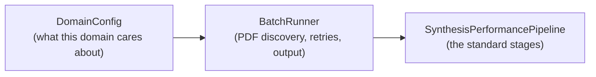

A *case study* is LeMat-Synth pointed at one scientific domain: the same
pipeline, with domain-specific choices about which materials to look for, which
plots are worth reading, and how results are written out.

Three are shipped with the repository. Each is a thin script — a few dozen lines
— on top of two reusable pieces:



`BatchRunner` handles everything domain-independent — PDF and supplementary-file
discovery, rate-limit-aware retries, resumable runs, progress reporting.
`DomainConfig` supplies the four things that differ between domains. You never
edit the runner; you assemble a config.

---

## The three built-in domains

| Domain | What it extracts | Script | Guide |
|---|---|---|---|
| **Thermocatalysis** | Synthesis + NH₃-decomposition conversion curves, benchmarked against human ground truth across several VLMs | [`case_study_thermocatalysis/`](https://github.com/LeMaterial/lematerial-llm-synthesis/tree/main/examples/scripts/case_study_thermocatalysis) | [Thermocatalysis]() |
| **Superconductors** | Synthesis + critical temperature *T*<sub>c</sub>, read both from text and geometrically from ρ(T)/R(T) plots | [`case_study_superconductors/`](https://github.com/LeMaterial/lematerial-llm-synthesis/tree/main/examples/scripts/case_study_superconductors) | [Superconductors]() |
| **Porous materials** | Synthesis + adsorption isotherms for MOFs, zeolites and COFs | [`case_study_porosity/`](https://github.com/LeMaterial/lematerial-llm-synthesis/tree/main/examples/scripts/case_study_porosity) | [Porous materials]() |

Building a fourth one — electrochemistry, battery cycling, thermoelectrics,
anything with a plot and a recipe — is covered in
[Building your own case study](), and built end to end in
[Tutorial 7]().

---

## Running a built-in domain

Every case-study script takes the same two positional arguments and the same
three flags:

```bash
uv run examples/scripts/case_study_porosity/run.py <pdf_dir> <output_dir> [flags]
```

| Flag | Effect |
|---|---|
| `--max N` | Process only the first *N* papers — always do this first |
| `--skip-existing` | Skip papers that already have results, so an interrupted run resumes |
| `--skip-figures` | Text and synthesis only: no figure detection, no VLM, much faster and cheaper |

Thermocatalysis is the exception — it adds a caching and evaluation harness on
top, documented on [its own page]().


The `data/` directory is git-ignored, so **no PDFs or ground-truth files ship
with the repository**. Every case study needs you to supply your own corpus.
[Tutorial 2]() shows how to assemble one from the
`LeMat-Synth-Papers` dataset.


---

## Choosing a starting point




Use the built-in `DomainConfig` factory and point the script at your PDFs:

```python
DomainConfig.for_catalysis()
DomainConfig.for_porosity()
DomainConfig.for_superconductivity(claude_model="claude-sonnet-4-20250514")
```



Start from that factory, then override the one piece that differs — usually
the [plot filter](#1--plotfilterconfig--which-plots-are-relevant)
or the [material prompt](#2--material-extraction-prompt--what-to-look-for).



Work through [Tutorial 7](), which builds a
thermoelectrics domain from an empty file and tests each piece as it goes,
then keep [Building your own case study]() open as the API
reference.



Skip case studies altogether — `lemat-synth batch` over a folder of PDFs is
enough. See the [CLI Reference]().



