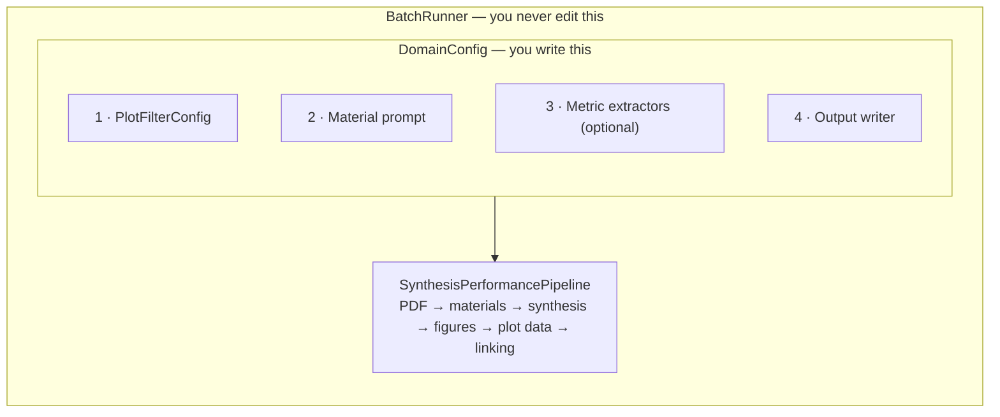

Pointing LeMat-Synth at a new scientific domain — electrochemistry, battery
cycling, thermoelectrics, photocatalysis — does not require touching the
pipeline. You assemble a `DomainConfig` from four pieces and hand it to
`BatchRunner`, which already knows how to find PDFs, detect supplementary
files, retry on rate limits, resume interrupted runs, and report progress.



Everything below builds up to a complete worked example: the porosity case
study, from an empty file to a running script.


Prefer to work through this by running it?
[Tutorial 7 — Building a custom case study]() builds a
thermoelectrics domain from scratch in a notebook, testing each of the four
pieces as it goes. Most of it costs nothing to run, and it works on Colab
without a local install.


---

## 1 · `PlotFilterConfig` — which plots are relevant?

A paper contains many figures — XRD patterns, SEM images, TGA curves — and only
a few of them carry the performance data you care about. `PlotFilterConfig`
matches axis labels and units so that only domain-relevant plots reach the
downstream VLM, which is both a quality and a cost decision.

Start from a preset if one fits:

```python
from llm_synthesis.config.plot_filter_config import PlotFilterConfig

PlotFilterConfig.for_catalysis()          # T vs. conversion / yield
PlotFilterConfig.for_superconductivity()  # R(T) / ρ(T)
PlotFilterConfig.for_electrochemistry()   # current / capacitance vs. voltage
PlotFilterConfig.for_coverage()           # P vs. adsorption isotherms
PlotFilterConfig.no_filter()              # keep every plot
```

Or build one:

```python
filter_cfg = PlotFilterConfig(
    x_axis_labels=["current density", "j"],
    x_axis_units=["ma/cm2", "a/cm2"],
    y_axis_keywords=["overpotential", "faradaic efficiency"],
    y_axis_units=["%", "mv"],
    filter_x_axis=True,
    filter_y_axis=True,
)
```

| Field | Purpose |
|---|---|
| `x_axis_labels` | Substrings matched case-insensitively against the x-axis label |
| `x_axis_units` | Unit strings that also signal a relevant x-axis |
| `y_axis_keywords` | Substrings matched against the y-axis label |
| `y_axis_units` | Unit strings that signal a relevant y-axis |
| `y_axis_exclude_patterns` | Veto list — overrides keyword matches (e.g. exclude *field* for superconductors) |
| `filter_x_axis` / `filter_y_axis` | Set either to `False` to ignore that axis entirely |


Write the veto list before you think you need it. Most false positives come
from plots that share vocabulary with the real thing — a *selectivity vs.
temperature* curve looks a lot like a *conversion vs. temperature* curve to a
keyword matcher.


### Axis labels are symbols, not words

This is the single most common reason a filter that looks right drops real
plots. You write your keyword list from the figure *captions* — "shear stress",
"resistivity" — but the filter matches the **axis label**, and axis labels are
typeset symbols. A rheology paper's Herschel-Bulkley plot is captioned *"flow
behaviour"* and its y-axis reads `$\sigma - \sigma_0$`. A keyword list
containing `"shear stress"` misses it completely.

`PlotFilterConfig` normalises LaTeX to Unicode before matching
(`\sigma` → `σ`, `\rho` → `ρ`, `\mu` → `μ`, and so on), so the fix is to put
the **Unicode symbol** in the keyword list next to the English name:

```python
y_axis_keywords=[
    "shear stress", "viscosity", "storage modulus", "complex modulus",
    "σ", "η", "τ",            # ← the symbols that actually appear on the axis
]
```

The built-in superconductivity preset carries the same scar: its veto list
contains `"ρ-ρ"`, a symbol pattern, not the word *resistivity*.

### When to turn an axis off entirely

`filter_x_axis=False` and `filter_y_axis=False` exist for domains where one axis
carries no signal. Use them when your relevant plots have **no common axis
family**:

| Domain | x-axes across the relevant plots | Filter on x? |
|---|---|---|
| Catalysis | temperature, temperature, temperature | Yes — it discriminates |
| Thermoelectrics | temperature everywhere (so does everything else) | Yes, but the y-axis does the real work |
| Rheology | shear rate, shear stress, strain, drying time, angular frequency | **No** — `filter_x_axis=False` |

A rheology filter that tries to enumerate that x-axis set will silently drop
whichever one it forgot. Turning x off and letting a well-vetoed y-axis carry
the whole decision is both simpler and more accurate.

Full field reference: [Configuration API]().

---

## 2 · Material extraction prompt — what to look for?

Two strings steer the material extractor:

- **`material_extraction_instructions`** — free-text instructions to the LLM. Be
  specific about variants, dopings and loadings.
- **`material_output_description`** — the expected output format, e.g.
  *"comma-separated chemical formulas including loading percentages"*.

Everything downstream depends on these. If the extractor returns `"Ru/MgO"` when
the paper studies four different Ru loadings, the synthesis extractor will merge
four recipes into one and the linker will have nothing to attach the four
performance curves to. Say explicitly whether each doping level is its own
entry, whether precursors count, and whether to include variant labels.

---

## 3 · Domain metric extractors (optional)

Beyond the standard pipeline output you can attach up to two extra passes. Both
return the same shape — `{material_name: {metric_key: value}}` — and both are
optional; pass `None` to skip.




`BaseTextMetricExtractor` — one extra LLM call over the paper text, run once
per paper before VLM post-processing.

```python
from typing import Any
from llm_synthesis.domain_metrics.base import BaseTextMetricExtractor

class BandgapTextExtractor(BaseTextMetricExtractor):
    def extract(
        self, paper_text: str, materials: list[str]
    ) -> dict[str, Any]:
        # Call your LLM, parse the output.
        return {
            "Cu0.5Ba0.5": {"bandgap_eV": 1.8, "measured_at_K": 300},
        }
```

Materials missing from the returned dict are treated as having no data.



`BaseVLMMetricProcessor` — one extra VLM pass over the plots that already
passed your filter, run after linking so it sees the full context.

```python
from typing import Any
from llm_synthesis.domain_metrics.base import BaseVLMMetricProcessor

class OnsetVLMProcessor(BaseVLMMetricProcessor):
    def process(
        self,
        relevant_plots,   # list[tuple[int, ExtractedLinePlotData]]
        plot_figures,     # list[FigureInfo] — carries the image bytes
        plot_mappings,    # list[PlotMaterialMapping] from the linker
        materials,        # list[str]
        paper_text,       # full paper text, for context
    ) -> dict[str, Any]:
        return {
            "Cu0.5Ba0.5": {"onset_current_mA": 12.3},
        }
```

Use this when the quantity you want is *geometric* rather than tabular — a
transition temperature, an onset, an intercept — something you read off the
shape of the curve rather than from a digitised point.




### Pin the *definition*, not just the unit

Asking for one unit is the obvious rule. The subtler one: when a quantity has
more than one accepted determination method, say which you want, or the column
silently mixes them.

Real example. A rheology paper tabulates yield stress twice for the same
material — once from a Herschel-Bulkley fit, once from the G′ crossover:

| SIS (vol %) | σ_y from Herschel-Bulkley | σ_y from G′ |
|---|---|---|
| 3 | 18.31 Pa | 45.21 Pa |
| 10 | 683.02 Pa | 721.73 Pa |

A field described only as *"yield stress in Pa"* makes the model choose, and it
will choose differently across papers. Name the method:

```python
yield_stress_HB_Pa: float | None = dspy.OutputField(
    description=(
        "Yield stress from a Herschel-Bulkley fit, in Pa. If the paper only "
        "reports a G' crossover yield stress, leave this null and use "
        "yield_stress_G_Pa instead — never mix the two determinations."
    )
)
```

Same trap: onset vs. midpoint vs. zero-resistance *T*<sub>c</sub>, BET vs.
Langmuir surface area, peak vs. average conversion.

### Don't hard-code *which* variable varies

A tempting metric schema names the thing that differs between samples:

```python
additive_name: str | None       # e.g. "SIS"
additive_concentration: str | None  # e.g. "6 vol%"
```

That works until the next paper in the same field varies something else. In one
rheology corpus, two papers varied binder concentration at fixed solid loading
and a third varied solid loading with a fixed vehicle — so the model put the
vehicle's name in `additive_name` and the solid loading in
`additive_concentration`, and the column stopped meaning one thing.

Prefer a generic pair plus the specific quantities you actually want:

```python
series_variable: str | None   # "SIS concentration" | "solid loading" | ...
series_value: str | None      # "6 vol%"
solid_loading_vol_pct: float | None
```

---

## 4 · `BaseOutputWriter` — how to save results

| Writer | Best for | Output |
|---|---|---|
| `AnnotatedJsonWriter` | Rich, qualitative results | `<output_dir>/<paper_id>/<material>.json` + linking summaries |
| `CsvMasterWriter` | Tabular data aggregated across papers | The same JSON, plus a growing master CSV with one row per (paper, material) |

For a custom CSV schema, subclass `CsvMasterWriter` and override
`_build_flat_records`:

```python
from typing import Any
from llm_synthesis.runners.output_writers.csv_writer import CsvMasterWriter

MY_COLUMNS = ["paper_id", "material", "bandgap_eV", "synthesis_method"]

class BandgapWriter(CsvMasterWriter):
    def __init__(self) -> None:
        super().__init__(
            csv_columns=MY_COLUMNS, master_csv_name="bandgaps.csv"
        )

    def _build_flat_records(
        self,
        paper_id: str,
        result,                     # PipelineResult
        text_metrics: dict[str, Any],
        vlm_metrics: dict[str, Any],
    ) -> list[dict]:
        return [
            {
                "paper_id": paper_id,
                "material": entry.material,
                "bandgap_eV": text_metrics.get(entry.material, {}).get(
                    "bandgap_eV"
                ),
                "synthesis_method": (
                    entry.synthesis.synthesis_method
                    if entry.synthesis
                    else None
                ),
            }
            for entry in result.results
        ]
```

---

## Putting it together — the porous materials case study

[`examples/scripts/case_study_porosity/run.py`](https://github.com/LeMaterial/lematerial-llm-synthesis/blob/main/examples/scripts/case_study_porosity/run.py)
is the shortest complete example. Here it is, built from scratch.

### Step 1 — Decide which plots to keep

Adsorption isotherms have pressure on the x-axis and uptake on the y-axis. The
veto list removes temperature, heat, selectivity and permeability plots, which
share vocabulary with isotherms but are not isotherms:

```python
from llm_synthesis.config.plot_filter_config import PlotFilterConfig

plot_filter = PlotFilterConfig(
    x_axis_labels=[
        "pressure", "p", "p/p0", "p/p₀", "relative pressure",
        "p (bar)", "p (kpa)", "p (mpa)", "p (atm)", "p (pa)",
        "p [bar]", "p [kpa]", "p [atm]",
    ],
    x_axis_units=["bar", "kpa", "mpa", "atm", "pa", "p0", "p/p0"],
    y_axis_keywords=[
        "loading", "uptake", "adsorption", "coverage", "surface area",
        "amount adsorbed", "quantity adsorbed",
        "cm³/g", "cm3/g", "mmol/g", "mol/kg", "mg/g", "wt%", "cc/g",
    ],
    y_axis_units=[
        "mmol/g", "mol/kg", "cm³/g", "cm3/g", "cc/g", "mg/g",
        "wt%", "ml/g", "l/g", "g/g", "mmol g⁻¹", "cm³ g⁻¹",
    ],
    y_axis_exclude_patterns=[
        "temperature", "time", "heat", "enthalpy",
        "selectivity", "permeability", "diffusivity",
    ],
    require_y_keyword_with_percentage=False,
)
```

### Step 2 — Tell the material extractor what to look for

Each framework variant — different linker, metal node, or activation condition —
must be a separate entry, because porosity is what varies between them:

```python
material_extraction_instructions = (
    "Extract ALL distinct porous or framework material compositions "
    "that were synthesized and characterized in this paper. "
    "If the paper studies multiple variants (e.g., different linkers, "
    "metal nodes, activation conditions) list EACH variant separately. "
    "Focus on materials for which adsorption or porosity data are reported."
)

material_output_description = (
    "ALL distinct synthesized porous material compositions as a "
    "comma-separated list using chemical formulas or IUPAC names. "
    "Include variant labels where relevant (e.g., 'MOF-5-activated', "
    "'ZIF-8-NH2')."
)
```

### Step 3 — Choose an output writer

Nothing is needed beyond what the pipeline already extracts, so both optional
metric extractors stay `None` and results go out as per-material JSON:

```python
from llm_synthesis.runners.output_writers.json_writer import AnnotatedJsonWriter

output_writer = AnnotatedJsonWriter()
```

### Step 4 — Assemble and run

```python
from llm_synthesis.config.domain_config import DomainConfig
from llm_synthesis.runners.batch_runner import BatchRunner

domain = DomainConfig(
    name="porosity",
    plot_filter_config=plot_filter,
    material_extraction_instructions=material_extraction_instructions,
    material_output_description=material_output_description,
    text_metric_extractor=None,
    vlm_metric_processor=None,
    output_writer=output_writer,
)

runner = BatchRunner(
    domain_config=domain,
    gemini_model="gemini-3.0-flash",
    claude_model="claude-sonnet-4-20250514",
    material_model="gemini-3.0-pro",
    synthesis_max_tokens=80_000,
    linker_max_tokens=32_000,
)
runner.run(
    pdf_dir="/path/to/pdfs",
    output_dir="/path/to/results",
    skip_existing=True,
)
```

That is exactly what `DomainConfig.for_porosity()` returns — the factory method
is a convenience wrapper around these four steps, nothing more.


Run with `max_papers=2` (or `--max 2` from the command line) and
`skip_figures=True` first. That exercises OCR, material extraction and
synthesis extraction in a couple of minutes and for a few cents, which is
where most prompt problems show up. Turn figures on once the material list
looks right.


---

## `BatchRunner` reference

```python
BatchRunner(
    domain_config,                              # required
    gemini_model="gemini-3.0-flash",            # synthesis extraction + judge
    claude_model="claude-sonnet-4-20250514",    # plot reading
    linker_model="gemini-3.0-flash",            # series → material linking
    material_model=None,                        # defaults to gemini_model
    synthesis_max_tokens=80_000,
    linker_max_tokens=32_000,
    plot_vlm=None,                              # LLM_REGISTRY key to use
                                                # LiteLLM instead of Claude
    max_workers=4,
)

runner.run(
    pdf_dir,
    output_dir,
    max_papers=None,
    skip_existing=False,
    skip_figures=False,
    phase="all",          # "all" | "synthesis" | "vlm"
    cache_dir=None,
)
```


**`claude_model` is not a registry key.** The other three model arguments are
resolved through `LLM_REGISTRY` by `get_llm_from_name`, so they take *aliases*
like `gemini-3.0-flash` or `claude-sonnet-4.6`. `claude_model` is passed
straight to the Anthropic SDK by `ClaudeLinePlotDataExtractor`, so it needs a
**raw Anthropic model ID** — `claude-sonnet-4-6`, not the `claude-sonnet-4.6`
alias.

Getting this wrong fails *softly*. Every figure logs a 404 warning, plot
extraction returns nothing, and the batch still finishes and reports
`[OK] paper: 4 materials, 0 plots` — indistinguishable from a paper that
genuinely had no plots. If a run reports zero plots on papers you know have
figures, grep the log for `not_found_error` before touching your filter.


| Argument | Takes | Example |
|---|---|---|
| `gemini_model`, `material_model`, `linker_model` | `LLM_REGISTRY` alias | `gemini-3.0-flash`, `claude-sonnet-4.6` |
| `claude_model` | **raw Anthropic model ID** | `claude-sonnet-4-6` |
| `plot_vlm` | registry alias *or* raw LiteLLM string — overrides `claude_model` and switches to `LiteLLMPlotDataExtractor` | `gemini-3-flash` |

The alias list is in
[Available LLM models](#available-llm-models).
Despite the names, `gemini_model` and `linker_model` accept any registry alias —
passing `claude-sonnet-4.6` to `gemini_model` is fine and is how you run the
whole text side on Claude.

---

## What a first real run looks like

A worked example, so you know what to expect and what "wrong" looks like. Three
real direct-ink-writing rheology papers (An 2020, Cipollone 2022, Hossain 2023),
`skip_figures=True`, all text models on Claude Sonnet:

```
Papers processed: 3/3     Failed: 0     Total time: 222s (3.7 min)
  [OK] an_2020:        4 formulations
  [OK] hossain_2023:   6 formulations
  [OK] cipollone_2022: 3 formulations
→ 13 rows in rheology_master.csv
```

**What went right.** The material prompt enumerated every formulation in each
series with its distinguishing concentration (`NiZn-ferrite suspension with
6 vol% SIS`, `PZT ink with 52.5 vol% solids and 2 wt% dispersant`), and every
yield stress matched the source table exactly — the numbers came out of tables,
not prose, which the `evidence` field made obvious at a glance because it quoted
rows like `P50D1 | 79.72 | 0.39 | 95.09`.

**What went wrong, and what it taught.**

| Symptom | Cause | Fix |
|---|---|---|
| A real plot silently dropped | y-axis read `$\sigma - \sigma_0$`; keyword list said `"shear stress"` | Add the Unicode symbol — see [above](#axis-labels-are-symbols-not-words) |
| `0 plots` on every paper, run still `[OK]` | `claude_model` given a registry alias instead of a raw Anthropic ID | See the [warning above](#batchrunner-reference) |
| `synthesis_method` inconsistent for identical procedures | The closed enum has no value for "disperse a powder into a vehicle" — the same mixing step became `other` on one ink and `mechanical mixing` on its sibling *in the same paper* | Add an enum value: [Tutorial 6]() |
| `additive_concentration` held a solid loading | Schema assumed which variable varies | [Don't hard-code it](#dont-hard-code-which-variable-varies) |

That third row is worth dwelling on. When your domain's process is not in
`GeneralSynthesisOntology`'s `synthesis_method` enum, you do not get an error —
you get *inconsistent* labels, which is worse, because the column looks
populated. Check that field on your first run; if it is noisy, the fix is a
schema change, not a prompt change.

---

## Decision guide

| I want to… | What to change |
|---|---|
| Filter a different kind of plot | Customise `PlotFilterConfig` |
| Extract a different class of materials | Edit `material_extraction_instructions` / `material_output_description` |
| Pull a scalar out of the text (bandgap, yield, *T*<sub>c</sub>) | Implement `BaseTextMetricExtractor` |
| Read a value off the *shape* of a figure | Implement `BaseVLMMetricProcessor` |
| Aggregate everything into one growing CSV | Use `CsvMasterWriter`, or subclass it for custom columns |
| Keep rich per-material JSON with annotation templates | Use `AnnotatedJsonWriter` |
| Skip figures entirely — faster and cheaper | `--skip-figures`, or `skip_figures=True` in `runner.run()` |
| Change *what fields* get extracted at all | Edit the ontology — [Tutorial 6]() |
| Use a different LLM anywhere | [Configuration & Models]() |

---

## Checklist

1. **List the figures you expect**, with a `True`/`False` verdict each, and keep
   it as a regression test — free, instant, and it catches the expensive errors.
2. **Write the veto list before the keyword list.**
3. **Put the axis *symbols* in the keyword list**, not just the English names.
4. **Turn off an axis** that carries no signal in your domain.
5. **Check the material list on two or three papers** before any batch.
6. **Make every metric optional**, say what absent means, pin the unit *and* the
   determination method.
7. **Add an `evidence` field** to anything a human may need to spot-check.
8. **Test the writer against a hand-built `PipelineResult`**, including an entry
   whose `synthesis` is `None`.
9. **First run: `max_papers=2, skip_figures=True`.** Then turn figures on for one
   paper and read the `Skipping plot …` lines before scaling up.
10. **Verify `claude_model` is a raw Anthropic ID** if you turned figures on and
    got zero plots.

---

## Where to go next

- [Tutorial 7]() — the same four pieces, built and tested
  step by step in a runnable notebook
- [Architecture]() — how the stages fit together
  and where to add a new backend
- [Output Format]() — what your writer will receive
- [Python API]() — driving the pipeline directly,
  without `BatchRunner`
