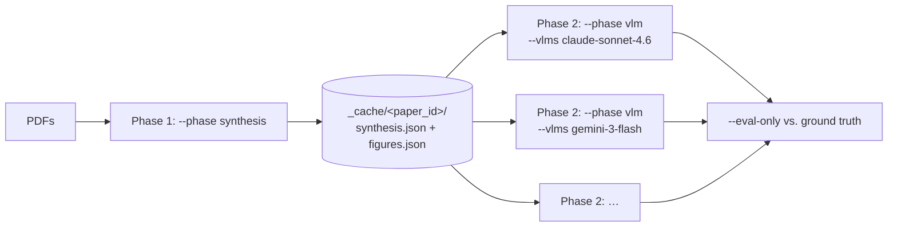

End-to-end workflow for ammonia-decomposition catalysts: extract synthesis
procedures *and* conversion-vs-temperature curves from a folder of PDFs, then
score several vision models against human-annotated ground truth.

This is the most elaborate of the three case studies, because it doubles as the
**VLM benchmark harness** used in the paper. If you only want catalysis data and
not a model comparison, `lemat-synth batch papers/ domain=catalysis
with_performance=true` does the extraction half in one command.

**Source** — [`examples/scripts/case_study_thermocatalysis/`](https://github.com/LeMaterial/lematerial-llm-synthesis/tree/main/examples/scripts/case_study_thermocatalysis)

| File | Purpose |
|---|---|
| `run.py` | Single entry point — extraction, caching, and multi-VLM evaluation |
| `eval_vlm.py` | RMSE/MAE against human ground truth (imported by `run.py`) |
| `catalysis_map.py` | Generates seven publication figures from batch results |
| `run_case_study.sh` | Full walkthrough — runs all three phases end to end |
| `results_notebook.ipynb` | Interactive exploration of a completed run |

An interactive single-paper version of the same pipeline lives in
[`examples/notebooks/dev/catalysis_synthesis_with_performance.ipynb`](https://github.com/LeMaterial/lematerial-llm-synthesis/blob/main/examples/notebooks/dev/catalysis_synthesis_with_performance.ipynb).

---

## Prerequisites

```
ANTHROPIC_API_KEY=...              # plot reading
GEMINI_API_KEY=...                 # materials, synthesis, linking
MISTRAL_API_KEY=...                # OCR
OPENROUTER_QWEN_API_KEY=...        # only if benchmarking Qwen VLMs
OPENROUTER_DEEPSEEK_API_KEY=...    # only if benchmarking DeepSeek VLMs
```


`data/` is git-ignored — neither the catalysis PDFs nor the human ground truth
ship with the repository. `run.py` defaults to `data/papers_catalysis/` for
input and `data/results_catalysis_human/` for ground truth (`--gt`); point
those at your own corpus. `--match-gt-only` restricts a run to the PDFs that
have a matching ground-truth folder, which is what you want while iterating.


---

## Quickstart — everything in one script

```bash
bash examples/scripts/case_study_thermocatalysis/run_case_study.sh
```

Edit the `VLMS=()` array at the top to choose which models to benchmark. The
script runs all three phases in order and can be launched from any directory.

---

## The two-phase workflow

Synthesis extraction (OCR → materials → synthesis → figure detection) is slow
(~30 min/paper) and **identical for every VLM**. Plot reading (~5 min/paper) is
the only VLM-dependent part. Splitting them means you pay the expensive half
once:



**Phase 1 — run once.**

```bash
uv run examples/scripts/case_study_thermocatalysis/run.py \
    --pdf-dir data/papers_catalysis \
    --output  data/results_cache \
    --phase   synthesis \
    --match-gt-only \
    --no-eval \
    --skip-existing
```

**Phase 2 — run once per VLM.** Reads the cache, so no re-extraction:

```bash
uv run examples/scripts/case_study_thermocatalysis/run.py \
    --output data/results_catalysis/claude-sonnet-4.6 \
    --phase  vlm \
    --cache  data/results_cache \
    --vlms   claude-sonnet-4.6 \
    --single-dir
```

Repeat with `--vlms gemini-3-flash`, `--vlms gpt-4o`, and so on, changing
`--output` each time.

<details>
<summary><b>Cache layout</b></summary>

```
data/results_cache/_cache/
    Teng_2024_Ru/
        synthesis.json   ← materials + synthesis + paper text
        figures.json     ← detected figures with base64 image data
    Zhou_2021_.../
        synthesis.json
        figures.json
```

Delete a paper's folder to force it to be re-extracted on the next Phase 1 run.

</details>

---

## Evaluation

Compare every VLM you ran against the ground truth:

```bash
uv run examples/scripts/case_study_thermocatalysis/run.py \
    --output data/results_catalysis \
    --gt     data/results_catalysis_human \
    --vlms   claude-sonnet-4.6 gemini-3-flash gpt-4o \
    --eval-only \
    --metric rmse \
    --csv    data/results_catalysis/ranking.csv
```

Prints a ranked table and writes `vlm_ranking_rmse.json` plus the CSV.

| Normalised RMSE | Reading |
|---|---|
| 0 | Perfect — every point matches the annotation |
| 0.02 – 0.15 | Good — usable for downstream analysis |
| 0.15 – 0.3 | Marginal — spot-check before trusting |
| > 0.3 | Poor — the model is misreading axes or series |

---

## Figures

```bash
uv run examples/scripts/case_study_thermocatalysis/catalysis_map.py \
    data/results_catalysis/claude-sonnet-4.6 \
    --out-dir data/results_catalysis/claude-sonnet-4.6/figures
```

Writes PNG + PDF for seven figures — conversion landscape, metal/support
heatmap, synthesis network, radar charts, promoter analysis, conversion by
synthesis method, and a 3D waterfall — plus `landscape_data.csv`.

Optional: `--use-llm` (LLM-assisted parsing of material names), `--ref-temp 500`
(reference temperature for cross-material comparison), `--debug` (print a data
inventory instead of plotting).

---

## Output layout

```
data/results_catalysis/
    <vlm_name>/
        <paper_id>/
            <material>.json            ← synthesis procedure + plot_data coordinates
            performance_mappings.json  ← which plot series → which material
            linking_summary_llm.json   ← linking stats + quality scores
            batch_summary.json         ← run timing + material counts
        figures/                       ← catalysis_map.py output
    manifest.json                      ← which PDFs ran + ground-truth mapping
    vlm_ranking_rmse.json              ← VLM ranking by mean RMSE
    ranking.csv                        ← per-material scores for all VLMs
```

Each `<material>.json` carries the standard synthesis object plus the digitised
curve:

```json
{
  "material": "Ru/MgO(110)",
  "synthesis": { "…synthesis procedure…" },
  "performance": {
    "material_name": "Ru/MgO(110)",
    "plot_data": [{
      "series_name": "Ru/MgO(110)",
      "coordinates": [[350, 12.4], [400, 41.9], [450, 78.2]],
      "x_axis_label": "Temperature", "x_axis_unit": "°C",
      "y_axis_label": "NH3 conversion", "y_axis_unit": "%"
    }]
  }
}
```

Every field is explained in [Output Format]().

---

## All flags

| Flag | Default | Purpose |
|---|---|---|
| `--pdf-dir PATH` | — | Directory of catalysis PDFs |
| `--output PATH` | *required* | Base output directory |
| `--gt PATH` | `data/results_catalysis_human` | Ground-truth directory |
| `--vlms VLM [VLM …]` | built-in list | `LLM_REGISTRY` keys to run |
| `--phase all\|synthesis\|vlm` | `all` | Which half of the pipeline to run |
| `--cache PATH` | `--output` | Cache directory; required with `--phase vlm` |
| `--match-gt-only` | off | Only process PDFs that have a ground-truth folder |
| `--skip-existing` | off | Skip papers already processed |
| `--max N` | all | Process only the first *N* papers per VLM |
| `--eval-only` | off | Skip extraction, evaluate existing results |
| `--no-eval` | off | Skip evaluation even when `--gt` is set |
| `--single-dir` | off | Treat `--output` as a flat results directory (no `<vlm>/` level) |
| `--metric rmse\|mae` | `rmse` | Error metric |
| `--csv PATH` | — | Write combined per-material scores to CSV |

---

## Available VLMs

Any key from `LLM_REGISTRY` in
[`src/llm_synthesis/utils/llms.py`](https://github.com/LeMaterial/lematerial-llm-synthesis/blob/main/src/llm_synthesis/utils/llms.py)
works with `--vlms`. Commonly benchmarked:

| Key | Model | API key |
|---|---|---|
| `claude-sonnet-4.6` | Anthropic Claude Sonnet 4.6 | `ANTHROPIC_API_KEY` |
| `gemini-3-flash` | Google Gemini 3 Flash | `GEMINI_API_KEY` |
| `gemini-2.5-flash` | Google Gemini 2.5 Flash | `GEMINI_API_KEY` |
| `gpt-4o` | OpenAI GPT-4o | `OPENAI_API_KEY` |
| `qwen3.5-397b-a17b` | Qwen via OpenRouter | `OPENROUTER_QWEN_API_KEY` |
| `deepseek-v3.2` | DeepSeek via OpenRouter | `OPENROUTER_DEEPSEEK_API_KEY` |
| `mistral-medium` | Mistral Medium | `MISTRAL_API_KEY` |

The full table with cost guidance is in
[Configuration & Models](#available-llm-models).
