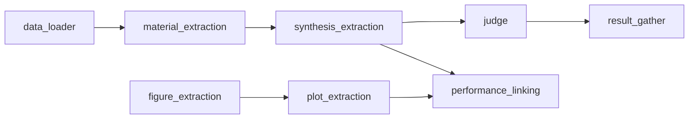

This page is for developers who want to understand how LeMat-Synth is built,
why it is structured the way it is, and where to start when contributing a new
feature.

---

## The guiding design principle

Every component in LeMat-Synth follows one rule: **separate the scientific
logic from the operational choices**.

- The *scientific logic* (what fields to extract, how to score quality, what
  the synthesis ontology looks like) lives in Python — it changes slowly and
  should be easy to review.
- The *operational choices* (which LLM to call, which dataset split to load,
  where to write results) live in YAML config files — they change often and
  should require no Python knowledge to tweak.

In practice this means you can swap Claude for Gemini, or switch from the full
HuggingFace dataset to a local folder of text files, by editing one line in a
YAML file (or passing a CLI flag). No Python needs to change.

---

## Pipeline stages



Each arrow is a handoff between two independently-runnable stages. The full
end-to-end flow is orchestrated by
[`SynthesisPerformancePipeline`]().

| Stage | What it does | Key class |
|-------|-------------|-----------|
| `data_loader` | Loads `Paper` objects (text + metadata) | `PaperLoaderInterface` |
| `material_extraction` | Finds material names in the paper text | `DspyTextExtractor` |
| `synthesis_extraction` | Extracts a structured recipe per material | `DspySynthesisExtractor` |
| `judge` | Scores extraction quality (1–5 per dimension) | `DspyGeneralSynthesisJudge` |
| `figure_extraction` | Detects and crops figures from the paper | `HFFigureExtractor` |
| `plot_extraction` | Reads x/y data from each figure | `ClaudeLinePlotDataExtractor` (CLI default), `LiteLLMPlotDataExtractor` |
| `performance_linking` | Matches plot series to synthesized materials | `SeriesMaterialLinker` |
| `result_gather` | Writes results to disk or cloud storage | `SynthesisFSResultGather` |

---

## Annotated source tree

```
src/llm_synthesis/
│
├── transformers/              # One sub-package per pipeline stage
│   ├── base.py                # ExtractorInterface[T, R] — the root contract
│   │                          # All concrete extractors inherit from this
│   ├── synthesis_extraction/
│   │   ├── base.py            # Abstract interface for synthesis extraction
│   │   └── dspy_synthesis_extraction.py   # DSPy-based implementation
│   ├── material_extraction/
│   │   └── dspy_extraction.py
│   ├── figure_extraction/
│   │   ├── base.py
│   │   └── hf_figure_extractor.py         # Uses Florence-2 / DINO
│   ├── figure_description/
│   │   └── dspy_figure_description.py
│   ├── plot_extraction/
│   │   ├── base.py
│   │   ├── litellm_plot_data_extraction.py
│   │   └── claude_extraction/             # Claude-specific vision path
│   ├── performance_linking/
│   │   ├── series_material_linker.py
│   │   └── plot_filter.py
│   ├── pdf_extraction/
│   │   ├── docling_pdf_extractor.py       # Primary PDF-to-text path
│   │   └── mistral_pdf_extractor.py       # Mistral OCR alternative
│   └── synthesis_filter/
│       └── llm.py                         # LLM-based relevance filter
│
├── models/                    # Pydantic schemas shared across stages
│   ├── ontologies/
│   │   └── general.py         # GeneralSynthesisOntology — the central schema
│   ├── paper.py               # Paper, SynthesisEntry (pipeline inputs)
│   ├── figure.py              # FigureInfo, FigureInfoWithPaper
│   ├── performance.py         # MaterialPerformanceData, LinkingStats
│   └── plot.py                # ExtractedLinePlotData
│
├── metrics/                   # Evaluation — comparing outputs to references
│   ├── judge/
│   │   ├── general_synthesis_judge.py     # LLM-as-judge for synthesis quality
│   │   └── linking_judge.py               # LLM-as-judge for plot-material linking
│   ├── text_extraction/
│   │   └── structured_synthesis.py        # Structural metrics (step count, etc.)
│   └── figure_extraction/
│       └── figure_extraction_metric.py
│
├── services/
│   ├── pipelines/             # High-level workflow orchestrators
│   │   ├── synthesis_performance_pipeline.py  # Main end-to-end pipeline
│   │   ├── plot_extraction_pipeline.py
│   │   ├── process_pdf_folder_pipeline.py
│   │   └── generate_synthetic_plots_pipeline.py
│   └── storage/               # File I/O abstraction (local and GCS)
│       ├── local_file_storage.py
│       └── gcs_file_storage.py
│
├── data_loader/
│   └── paper_loader/
│       ├── base.py                         # PaperLoaderInterface
│       ├── hf_paper_loader.py              # Load from HuggingFace dataset
│       ├── annotation_hf_paper_loader.py   # HF, restricted to annotations/
│       └── fs_paper_loader.py              # Load from local .txt files
│
└── utils/
    ├── dspy_utils.py           # LM initialisation, get_llm_from_name()
    ├── cost_tracking.py        # Per-call token/cost accounting
    ├── concurrency.py          # Semaphore-based rate limiting
    ├── prompt_utils.py         # Load system prompts from .txt files
    └── paper_id_utils.py       # arXiv ↔ HF ID normalisation

examples/
├── config/                    # Hydra YAML configs — one file per variant per stage
├── scripts/
│   ├── deployment/            # Primary runnable entry points
│   ├── evaluation/            # Compare LLM outputs against human annotations
│   ├── data_curation/         # Scraping, PDF extraction, HF dataset creation
│   └── case_study_*/          # Domain-specific analysis (superconductors, catalysis)
└── system_prompts/            # Plain-text LLM prompts loaded at runtime

annotations/                   # Human-verified ground-truth evaluation set
```

---

## Why each layer exists

### `transformers/` — one directory per stage

Each stage has its own sub-package with a `base.py` that defines the abstract
interface and one or more concrete implementations alongside it. The
`base.py` / concrete split is intentional:

- `base.py` tells you *what* a stage must do (its inputs and outputs).
- Concrete files tell you *how* one implementation does it.

This makes it easy to add a new backend (e.g. a Mistral-based synthesis
extractor) without changing the pipeline orchestrator — the pipeline only
depends on the abstract base.

### `models/` — shared schemas

All stages communicate through Pydantic models. The most important is
`GeneralSynthesisOntology` in `models/ontologies/general.py`. Every
extractor writes its output into this schema; every judge reads from it. If
you need to add a new field to what gets extracted, start here.

### `metrics/` — separated from transformers

Judges and metrics are deliberately kept out of `transformers/` because they
serve a different purpose: they *evaluate* outputs, they don't *produce* them.
The synthesis judge uses the same LLM-as-judge pattern as extraction, but its
output is evaluation scores, not synthesis procedures.

### `services/pipelines/` — thin orchestrators

Pipeline classes wire stages together and handle concurrency, error recovery,
and result writing. They contain almost no domain logic — they call
`extractor.forward()`, collect results, and pass them to the next stage. If
you are debugging a data-flow issue, start here.

### `examples/config/` — the operational layer

YAML files only. No Python. This is where you decide which concrete class
gets instantiated for each stage, which LLM it uses, and which dataset split
it reads. See the [Configuration & Models]() page
for details.

---

## Where to start developing

### Adding a new synthesis extractor

1. Read `src/llm_synthesis/transformers/synthesis_extraction/base.py` to
   understand the interface.
2. Create a new file in the same directory (e.g.
   `openai_synthesis_extraction.py`).
3. Subclass `ExtractorInterface` and implement `forward(input) -> GeneralSynthesisOntology`.
4. Add a new YAML variant in `examples/config/synthesis_extraction/` pointing
   `_target_` at your new class.
5. Test with:
   ```bash
   uv run python examples/scripts/deployment/extract_synthesis_procedure_from_text.py \
       synthesis_extraction=your_variant
   ```

### Adding a new data source

1. Read `src/llm_synthesis/data_loader/paper_loader/base.py`.
2. Subclass `PaperLoaderInterface` and implement `load() -> list[Paper]`.
3. Add a YAML variant in `examples/config/data_loader/`.

### Changing what fields are extracted

Edit `src/llm_synthesis/models/ontologies/general.py`. Add the new Pydantic
field with a clear `Field(description=...)`. The LLM will pick up the field
automatically because DSPy serialises the Pydantic schema into the prompt.

### Adding a new evaluation metric

1. Read `src/llm_synthesis/metrics/text_extraction/base.py`.
2. Subclass `TextToOntologyExtractionMetric` and implement `__call__`.
3. Use it in an evaluation script under `examples/scripts/evaluation/`.

### Understanding the full data flow

Open
`src/llm_synthesis/services/pipelines/synthesis_performance_pipeline.py` and
read top-to-bottom. Each method corresponds to one pipeline stage, and
`process_paper()` shows the order they execute in. `process_paper_async()` is the
same sequence with the independent LLM calls run concurrently — the CLI uses that
one, and the two must be kept in step when either is edited.

---

## Key cross-cutting utilities

| Utility | File | Use it when… |
|---------|------|--------------|
| `get_llm_from_name(name)` | `utils/dspy_utils.py` | You need a DSPy LM object from a model name string |
| `configure_dspy(lm)` | `utils/dspy_utils.py` | You are writing a standalone script and want a quick DSPy setup |
| `run_with_semaphore(sem, fn, *args)` | `utils/concurrency.py` | You are adding concurrent LLM calls and need rate limiting (semaphore comes first) |
| `read_prompt_str_from_txt(path)` | `utils/prompt_utils.py` | You want to load a system prompt from a `.txt` file |
| `folder_id_to_hf_id(pid)` | `utils/paper_id_utils.py` | Converting between local folder names and HF dataset IDs |
