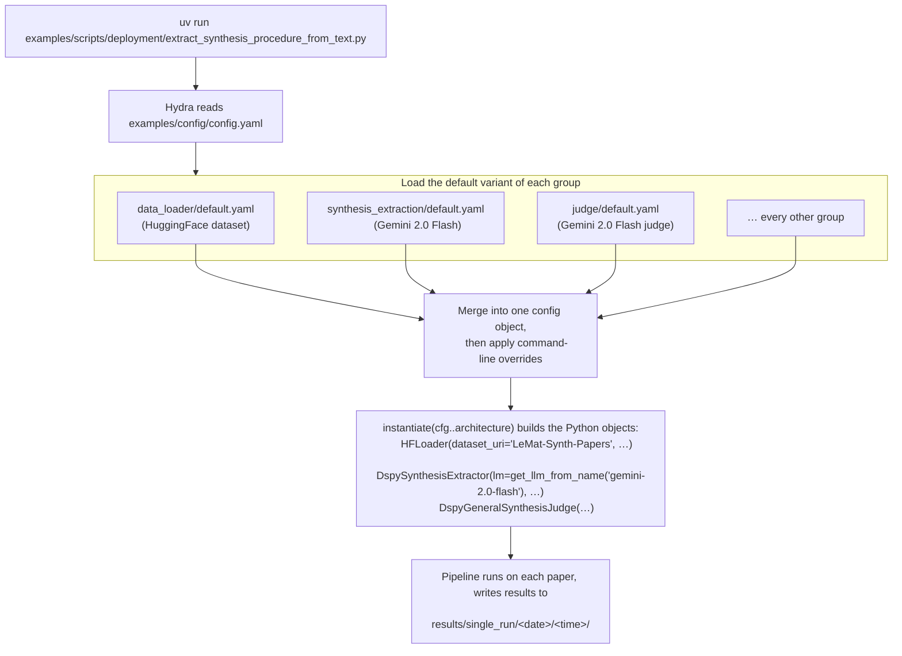
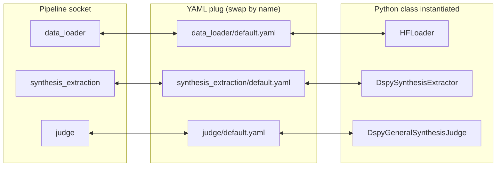

LeMat-Synth is configured with [Hydra](https://hydra.cc): YAML files describe
*which* components to run, Python describes *what* they do. This page covers both
levels — swapping a model or a data source from the command line, and the
composition machinery underneath (`_target_`, config groups, adding your own
variants).

---

## Two configuration systems, one repository

There are two independent entry points, and **they do not share configuration**.

| | `lemat-synth` CLI | Hydra deployment scripts |
|---|---|---|
| Config file | `examples/config/cli.yaml` (one flat file) | `examples/config/` (config groups) |
| Run it with | `lemat-synth extract paper.pdf` | `uv run examples/scripts/deployment/<script>.py` |
| Model names | LiteLLM strings (`gemini/gemini-2.0-flash`) | registry keys (`gemini-2.0-flash`) |
| Overrides | `key=value` | `key=value` **and** `group=variant` |
| Best for | one paper or one folder, standard pipeline | dataset-scale runs, multi-LLM ensembles, evaluation |

The CLI composes a single file with no `defaults:` list, so config-*group* swaps
are not available there:

```console
$ lemat-synth extract paper.txt judge=multi_llm
ConfigCompositionException: Could not override 'judge'.
```

Use the deployment scripts when you need one of these:

- **multi-LLM ensemble extraction and judging** (`synthesis_extraction=multi_llm`)
- **processing the full HuggingFace `LeMat-Synth-Papers` dataset**
- **evaluation against human annotations** (`data_loader=annotation`)
- **Hydra sweeps / multi-run mode**

Everything below refers to the deployment scripts. For the CLI's flat keys, see
the [CLI Reference]().


Run the deployment scripts **from the repository root**. Hydra finds its config
relative to the script file, but the scripts resolve data folders and system
prompts against the directory you launched from (`get_original_cwd()`), and
`hydra.job.chdir: true` moves the process into the timestamped run directory.


---

## How a run is composed

`examples/config/config.yaml` is the root file. Its `defaults:` list names one
YAML file per config group:

```yaml
defaults:
  - _self_
  - data_loader: default
  - synthesis_extraction: default
  - material_extraction: default
  - judge: default
  - result_save: default
  - plot_extraction: default
```

Each entry `group: variant` loads `examples/config/<group>/<variant>.yaml` and
merges it under that group name, so `synthesis_extraction/default.yaml` becomes
`cfg.synthesis_extraction` in Python. `_self_` means values written directly in
`config.yaml` (such as the `hydra:` block) win over the group defaults.



Think of it as a plug-board: each pipeline stage is a socket, each YAML file is a
plug, and `_target_` names the Python class inside the plug.



Passing `data_loader=annotation` swaps the whole plug: `AnnotationHFLoader` goes
into the socket instead of `HFLoader`.

### `_target_`: the YAML *is* the dependency-injection container

Every component is described by a `_target_` key naming a Python callable:

```yaml
architecture:
  _target_: llm_synthesis.transformers.synthesis_extraction.dspy_synthesis_extraction.DspySynthesisExtractor
  lm:
    _target_: llm_synthesis.utils.dspy_utils.get_llm_from_name
    llm_name: "gemini-2.0-flash"
    model_kwargs:
      temperature: 0.0
      max_tokens: 12000
  signature:
    _target_: llm_synthesis.transformers.synthesis_extraction.dspy_synthesis_extraction.make_dspy_synthesis_extractor_signature
    instructions: "Extract the structured synthesis for a specific material."
```

`hydra.utils.instantiate(cfg.synthesis_extraction.architecture)` then:

1. resolves `_target_` to the class or function;
2. recursively instantiates nested dicts that also carry a `_target_` (here: the
   LM and the signature);
3. passes every remaining key as a keyword argument.

Changing `_target_` replaces the implementation; changing the other keys changes
the constructor arguments — neither requires touching Python.

---

## The config groups

```
examples/config/
├── config.yaml               ← root: defaults list + hydra run/sweep dirs
├── data_loader/              ← where papers come from
│   ├── default.yaml          ← HuggingFace LeMat-Synth-Papers
│   ├── local.yaml            ← local folder of .txt files
│   └── annotation.yaml       ← only papers with human annotations
├── material_extraction/      ← which LLM identifies material names
│   ├── default.yaml          ← Gemini 2.5 Flash Lite
│   └── multi_llm.yaml        ← a list of LLMs, run in parallel
├── synthesis_extraction/     ← which LLM extracts synthesis procedures
│   ├── default.yaml          ← Gemini 2.0 Flash
│   └── multi_llm.yaml
├── judge/                    ← which LLM evaluates extraction quality
│   ├── default.yaml          ← Gemini 2.0 Flash
│   ├── multi_llm.yaml
│   └── linking.yaml          ← judge for plot↔material linking
├── result_save/              ← where and how results are written
│   ├── default.yaml
│   └── multi_llm.yaml
└── plot_extraction/          ← VLM stack for reading data off charts
    └── default.yaml
```


The repository-root `config/` directory is a different thing: it holds only
`cli.yaml`, the flat file used by the `lemat-synth` CLI.


### `data_loader/`

Controls which papers are loaded and how many.

| Variant | What it does | `_target_` class |
|---|---|---|
| `default.yaml` | Streams a split of the HF dataset `LeMaterial/LeMat-Synth-Papers` | `HFLoader` — `data_loader/paper_loader/hf_paper_loader.py` |
| `local.yaml` | Reads `.txt` files from a directory (`<paper>_SI.txt` is picked up as supplementary information) | `FSPaperLoader` — `data_loader/paper_loader/fs_paper_loader.py` |
| `annotation.yaml` | HF stream restricted to papers present in `annotations/` | `AnnotationHFLoader` — `data_loader/paper_loader/annotation_hf_paper_loader.py` |

Every variant also exposes `number_of_samples` **inside the group** — set it to
`null` to process everything, or to an integer to cap the run:

```bash
uv run ... data_loader.number_of_samples=10     # ✅
uv run ... number_of_samples=10                 # ❌ "Key 'number_of_samples' is not in struct"
```

### `synthesis_extraction/` and `material_extraction/`

Both share one structure — `default.yaml` uses a single LLM, `multi_llm.yaml`
adds an `llm_names: [...]` list and runs the extractor once per model, storing
every output keyed by model name.

```yaml
architecture:
  _target_: ...DspySynthesisExtractor
  signature:
    _target_: ...make_dspy_synthesis_extractor_signature
    instructions: "..."          # the task description that goes into the prompt
    output_description: "..."    # description of the expected output field
  lm:
    _target_: ...get_llm_from_name
    llm_name: "gemini-2.0-flash" # ← swap the LLM here
    model_kwargs:
      temperature: 0.0
      max_tokens: 12000
      num_retries: 3
    system_prompt:
      _target_: llm_synthesis.utils.read_prompt_str_from_txt
      prompt_path: "examples/system_prompts/synthesis_extraction/default.txt"
```

The system prompt is read from a plain `.txt` file at runtime, so editing that
file changes the model's persona and task framing without touching YAML or Python.

### `judge/`

`DspyGeneralSynthesisJudge` scores an extraction from 1 to 5 on seven criteria.
Beyond the usual `lm` block:

```yaml
enable_reasoning_traces: true   # keep the judge's written reasoning
confidence_threshold: 0.7       # minimum score to accept an extraction
```

`multi_llm.yaml` adds `llm_names: [...]` (one judge per model, giving an
*m × n* extractor-by-judge grid); `linking.yaml` configures `DspyLinkingJudge`
for the plot-to-material linking task instead.

### `result_save/`

| Variant | `_target_` class | Output |
|---|---|---|
| `default.yaml` | `SynthesisFSResultGather` | one result file per paper under `result_dir` |
| `multi_llm.yaml` | `MultiLLMResultGather` | per-LLM results plus the evaluation matrices |

### `plot_extraction/`

Configures the vision stack that reads numbers off charts: `vlm_names` (which
VLMs to try), `max_tokens`, `temperature`, `retry_temperatures`, and `rank_by` —
the metric used to pick the best read among several VLM attempts
(`mean_rmse_norm`, `mean_mae_norm`, `mean_pearson_r`, `mean_spearman_rho`,
`mean_icc`).

---

## Overriding settings from the command line

You never need to edit a YAML file to change one value. Overrides are applied
after all files are merged, so they always win.

```bash
# Swap the synthesis LLM (nested key inside a group)
uv run examples/scripts/deployment/extract_synthesis_procedure_from_text.py \
  synthesis_extraction.architecture.lm.llm_name=claude-sonnet-4.6

# Swap an entire group to another variant
uv run ... judge=multi_llm

# Read local text files instead of HuggingFace
uv run ... data_loader=local \
           data_loader.architecture.data_dir="/absolute/path/to/text_files"

# Process 10 papers only
uv run ... data_loader.number_of_samples=10

# Choose the output directory (default is a timestamped folder)
uv run ... hydra.run.dir=my_results/run1
```


Group overrides use the file name without `.yaml` (`judge=multi_llm`), value
overrides use the **full nested path** (`data_loader.architecture.data_dir=…`,
not `data_loader.data_dir=…`).


### Checking the config before a long run

Append `--cfg job` to print the fully merged config and exit without calling any
model:

```bash
uv run examples/scripts/deployment/extract_synthesis_procedure_from_text.py \
  synthesis_extraction=multi_llm --cfg job
```

---

## Available LLM models

These names are the keys of `LLM_REGISTRY` and are what `llm_name:` expects
(`synthesis_extraction.architecture.lm.llm_name=…`,
`judge.architecture.lm.llm_name=…`).

> **Source of truth.** The authoritative list lives in
> [`src/llm_synthesis/utils/llms.py`](https://github.com/LeMaterial/lematerial-llm-synthesis/blob/main/src/llm_synthesis/utils/llms.py).
> If you add a model there, add a row here too.

| Name (use in config) | Provider | API key needed | Notes |
|---|---|---|---|
| `gemini-2.5-flash-lite` | Google | `GEMINI_API_KEY` | Fastest, cheapest; default for material extraction |
| `gemini-2.0-flash` | Google | `GEMINI_API_KEY` | **Default**; good balance of speed and quality |
| `gemini-2.5-flash` | Google | `GEMINI_API_KEY` | Better quality, slightly slower |
| `gemini-2.5-pro` | Google | `GEMINI_API_KEY` | Highest quality Gemini 2.5 model |
| `gemini-3.0-pro` | Google | `GEMINI_API_KEY` | Gemini 3 preview, used as default linker |
| `gemini-3.0-flash` | Google | `GEMINI_API_KEY` | Latest Gemini flash |
| `gemini-3.0-flash-lite` | Google | `GEMINI_API_KEY` | Latest ultra-fast Gemini model |
| `gemini-3-flash` | Google | `GEMINI_API_KEY` | Gemini 3 flash with reasoning disabled |
| `claude-sonnet-4.6` | Anthropic | `ANTHROPIC_API_KEY` | Excellent for synthesis + plot extraction |
| `gpt-4o` | OpenAI | `OPENAI_API_KEY` | Strong general-purpose model |
| `gpt-4o-mini` | OpenAI | `OPENAI_API_KEY` | Cheaper OpenAI option |
| `gpt-4.1` | OpenAI | `OPENAI_API_KEY` | Latest OpenAI flagship |
| `gpt-o4-mini` | OpenAI | `OPENAI_API_KEY` | OpenAI o4-mini reasoning model |
| `gpt-o3-mini` | OpenAI | `OPENAI_API_KEY` | OpenAI o3-mini reasoning model |
| `mistral-small` | Mistral | `MISTRAL_API_KEY` | Mistral Small (latest) |
| `mistral-medium` | Mistral | `MISTRAL_API_KEY` | Mistral Medium (latest) |
| `mistral-large` | Mistral | `MISTRAL_API_KEY` | Good European-hosted option |
| `qwen3.5-35b-a3b` | Alibaba via OpenRouter | `OPENROUTER_QWEN_API_KEY` | Smaller Qwen open-weight model |
| `qwen3.5-397b-a17b` | Alibaba via OpenRouter | `OPENROUTER_QWEN_API_KEY` | Large open-weight model |
| `kimi-k2.5` | Moonshot via OpenRouter | `OPENROUTER_KIMI_API_KEY` | Moonshot Kimi K2.5 |
| `deepseek-v3.2` | DeepSeek via OpenRouter | `OPENROUTER_DEEPSEEK_API_KEY` | Strong reasoning model |

> **Rough cost guide** (order of magnitude, subject to change):
> - `gemini-2.5-flash-lite` / `gemini-2.0-flash`: ~$0.01–0.05 per paper
> - `gemini-2.5-flash` / `claude-sonnet-4.6` / `gpt-4o`: ~$0.05–0.20 per paper
> - `gemini-2.5-pro` / `gpt-4.1`: ~$0.20–0.50 per paper
>
> Cost scales with paper length and the number of materials per paper. Always test
> on a small batch first (`data_loader.number_of_samples=5`).

---

## Changing the data source

### HuggingFace (default)

Loads `LeMaterial/LeMat-Synth-Papers`, which requires a HuggingFace account with
access granted (request it on the dataset page).

```bash
uv run examples/scripts/deployment/extract_synthesis_procedure_from_text.py
uv run ... data_loader.number_of_samples=50          # cap the run
uv run ... data_loader.architecture.split=chemrxiv   # pick a split
```

### Local text files

One `.txt` file per paper; a supplementary file named `<paper>_SI.txt` is picked
up automatically.

```bash
uv run examples/scripts/deployment/extract_synthesis_procedure_from_text.py \
  data_loader=local \
  data_loader.architecture.data_dir="/absolute/path/to/my/text_folder"
```

To convert PDFs to text first:

```bash
uv run examples/scripts/deployment/extract_text_from_pdfs.py --help
```

---

## Domain-specific plot filtering

When figure extraction is enabled, plots are filtered so only domain-relevant ones
reach the linker (e.g. conversion vs. temperature for catalysis, and not XRD
patterns). This is **not** a Hydra config group: it is a `PlotFilterConfig` object
chosen in Python.

- In the CLI: `lemat-synth batch papers/ with_performance=true domain=catalysis`
  (`generic`, `catalysis`, `superconductors`, `electrochemistry`).
- In `extract_synthesis_with_performance.py`: `--domain catalysis|electrochemistry`,
  or `--no-filter` to keep every plot.
- In your own script:
  `PlotFilterConfig.for_catalysis()` / `.for_superconductivity()` /
  `.for_electrochemistry()` / `.no_filter()`, see
  [Configuration API]().

---

## Extending the configuration

### Add a new variant to an existing group

1. Copy an existing file in that group:
   ```bash
   cp examples/config/synthesis_extraction/default.yaml \
      examples/config/synthesis_extraction/my_variant.yaml
   ```
2. Edit `llm_name`, `instructions`, or `_target_` (if you wrote a new class).
3. Select it at runtime — no change to `config.yaml` or Python needed:
   ```bash
   uv run ... synthesis_extraction=my_variant
   ```

### Add a new config group

If you add a whole pipeline stage, create a directory under `examples/config/`
and register it in the `defaults:` list of `config.yaml`:

```yaml
defaults:
  - ...existing entries...
  - my_new_stage: default       # loads examples/config/my_new_stage/default.yaml
```

Then write `examples/config/my_new_stage/default.yaml` with a `_target_` pointing
at your stage's class.

### Write your own Hydra script

The existing deployment scripts are the template. The whole Hydra-specific part is
the decorator plus one `instantiate` call per stage:

```python
import hydra
from hydra.utils import get_original_cwd, instantiate
from omegaconf import DictConfig


@hydra.main(
    config_path="../../config",   # relative to THIS file → examples/config/
    config_name="config.yaml",
    version_base=None,
)
def main(cfg: DictConfig) -> None:
    original_cwd = get_original_cwd()          # you launched from the repo root

    data_loader = instantiate(cfg.data_loader.architecture)
    material_extractor = instantiate(cfg.material_extraction.architecture)
    synthesis_extractor = instantiate(cfg.synthesis_extraction.architecture)
    judge = instantiate(cfg.judge.architecture)
    result_gather = instantiate(cfg.result_save.architecture)

    for paper in data_loader.load():
        ...   # your extraction loop


if __name__ == "__main__":
    main()
```

Two details worth copying from
[`extract_synthesis_procedure_from_text.py`](https://github.com/LeMaterial/lematerial-llm-synthesis/blob/main/examples/scripts/deployment/extract_synthesis_procedure_from_text.py):
relative `data_dir` and `system_prompt.prompt_path` values are joined with
`get_original_cwd()` before instantiation (because `hydra.job.chdir: true` moves
the process into the run directory), and papers already present in `result_dir`
are skipped so an interrupted run can be resumed.

### Which script uses which system

| Script | Configured by | Purpose |
|---|---|---|
| `extract_synthesis_procedure_from_text.py` | Hydra (`examples/config/`) | Materials → synthesis → judge over a dataset |
| `extract_synthesis_multi_llm_judge.py` | Hydra (`*=multi_llm` variants) | *m × n* extractor-by-judge comparison grid |
| `extract_plot_data_multi_vlm.py` | Hydra (`plot_extraction/`) | Several VLMs read the same plots, ranked by `rank_by` |
| `extract_synthesis_with_performance.py` | `argparse` (`--input-path`, `--domain`, `--claude-model`, …) | Full synthesis + performance-linking run |
| `run_performance_only.py` | `argparse` | Performance linking on existing synthesis results |
| `extract_text_from_pdfs.py` | `argparse` | PDF → markdown conversion |

---

## Configuring in Python instead

If you would rather build the components yourself and skip YAML entirely, every
class shown above can be constructed directly — see the
[Python API guide]() and the
[API Reference](). The `lemat-synth` CLI's
`_build_pipeline_from_cfg` in
[`src/llm_synthesis/cli.py`](https://github.com/LeMaterial/lematerial-llm-synthesis/blob/main/src/llm_synthesis/cli.py)
is a complete worked example of assembling the pipeline in code.
