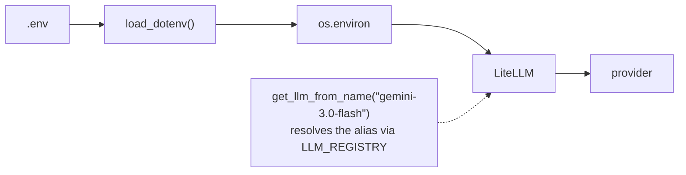

Seven runnable notebooks that take you from *reading* LeMat-Synth data to
*producing* it, and finally to *changing what gets produced*. Each one is
self-contained, states its prerequisites and cost up front, and explains what
every step is doing rather than just executing it.

They live in
[`examples/notebooks/tutorials/`](https://github.com/LeMaterial/lematerial-llm-synthesis/tree/main/examples/notebooks/tutorials)
in the repository, and each one runs **either locally or on Google Colab** — the
same file, no edited cells.

```bash
uv run jupyter lab examples/notebooks/tutorials/
```

Or open one on Colab and skip the install entirely:

- [](https://colab.research.google.com/github/LeMaterial/lematerial-llm-synthesis/blob/main/examples/notebooks/tutorials/01_explore_the_lemat_synth_dataset.ipynb) &nbsp; **1** — Explore the LeMat-Synth dataset
- [](https://colab.research.google.com/github/LeMaterial/lematerial-llm-synthesis/blob/main/examples/notebooks/tutorials/02_finding_papers.ipynb) &nbsp; **2** — Finding papers
- [](https://colab.research.google.com/github/LeMaterial/lematerial-llm-synthesis/blob/main/examples/notebooks/tutorials/03_batch_extraction_with_the_cli.ipynb) &nbsp; **3** — Batch extraction with the CLI
- [](https://colab.research.google.com/github/LeMaterial/lematerial-llm-synthesis/blob/main/examples/notebooks/tutorials/04_extracting_synthesis_and_performance.ipynb) &nbsp; **4** — Synthesis + performance from a paper
- [](https://colab.research.google.com/github/LeMaterial/lematerial-llm-synthesis/blob/main/examples/notebooks/tutorials/05_evaluating_extraction_quality.ipynb) &nbsp; **5** — Evaluating extraction quality
- [](https://colab.research.google.com/github/LeMaterial/lematerial-llm-synthesis/blob/main/examples/notebooks/tutorials/06_customizing_the_ontology.ipynb) &nbsp; **6** — Customising the ontology
- [](https://colab.research.google.com/github/LeMaterial/lematerial-llm-synthesis/blob/main/examples/notebooks/tutorials/07_building_a_custom_case_study.ipynb) &nbsp; **7** — Building a custom case study

---

## The tutorials

| # | Tutorial | Track | What you learn | API keys | Cost |
|---|----------|-------|----------------|----------|------|
| 1 | [Explore the LeMat-Synth dataset](https://github.com/LeMaterial/lematerial-llm-synthesis/blob/main/examples/notebooks/tutorials/01_explore_the_lemat_synth_dataset.ipynb) | Use the data | Load the published dataset, slice it by method, category and judge score, and turn a row back into a Pydantic object | HuggingFace access only | Free |
| 2 | [Finding papers](https://github.com/LeMaterial/lematerial-llm-synthesis/blob/main/examples/notebooks/tutorials/02_finding_papers.ipynb) | Use the data | Filter the 81k-paper corpus by category and keyword, with whole-word matching and an optional LLM relevance filter | HuggingFace access only | Free |
| 3 | [Batch extraction with the CLI](https://github.com/LeMaterial/lematerial-llm-synthesis/blob/main/examples/notebooks/tutorials/03_batch_extraction_with_the_cli.ipynb) | Extract | `lemat-synth extract` / `batch`, Hydra overrides, per-component API keys, and reading the output back into pandas | Gemini, or OpenRouter | Fractions of a cent |
| 4 | [Synthesis + performance from a paper](https://github.com/LeMaterial/lematerial-llm-synthesis/blob/main/examples/notebooks/tutorials/04_extracting_synthesis_and_performance.ipynb) | Extract | The whole pipeline on one fixed example paper: PDF → recipes → digitised performance curves → linked results, checked against a human ground truth | Gemini + Anthropic, or one OpenRouter key | $0.10–0.40, cached after the first run |
| 5 | [Evaluating extraction quality](https://github.com/LeMaterial/lematerial-llm-synthesis/blob/main/examples/notebooks/tutorials/05_evaluating_extraction_quality.ipynb) | Extract | Run the LLM judge, then measure how well four judges agree with human annotators on the 36-paper corpus | Gemini or OpenRouter (Part A only) | Near zero |
| 6 | [Customising the ontology](https://github.com/LeMaterial/lematerial-llm-synthesis/blob/main/examples/notebooks/tutorials/06_customizing_the_ontology.ipynb) | Extend | Add fields, add enum values, keep the prompts in sync, or bring a schema of your own | None | Free |
| 7 | [Building a custom case study](https://github.com/LeMaterial/lematerial-llm-synthesis/blob/main/examples/notebooks/tutorials/07_building_a_custom_case_study.ipynb) | Extend | Point the pipeline at a new domain: plot filter, material prompt, a domain metric extractor and a custom CSV schema, assembled into a `DomainConfig` | Gemini or OpenRouter | Under $0.01 |

The **track** says what a tutorial is for, not how hard it is: *Use the data*
reads what is already published, *Extract* produces new data from papers, and
*Extend* changes what "extracted" means — Tutorial 6 along the schema axis,
Tutorial 7 along the domain axis. Tutorial 3 comes before Tutorial 4
because one CLI command is how most people will run this — Tutorial 4 opens the
same pipeline up when you need to change it rather than run it.

---

## Which one should I start with?



**1 → 2.** Tutorial 1 reads the published dataset — for many use cases that
is the whole job, and it costs nothing. Tutorial 2 helps only if the papers
you care about are not in there yet.


**3 → 5, then 4 if you need it.** Tutorial 3 runs `lemat-synth batch` over a
folder and is all most people need; Tutorial 5 tells you whether to trust
the result. Tutorial 4 opens the same pipeline stage by stage — PDF parsing,
material extraction, plot digitisation, ground-truth check — for when the
defaults are not doing what you want.


**4 → 6 → 5.** Understand the pipeline, change the schema, then measure
whether the change helped. The
[Architecture guide]() covers the
component interfaces in more depth.


**7.** It builds a complete case study — thermoelectrics — from an empty
file: which figures to read, what counts as a material, the domain number to
pull out, and the output table. Most of it costs nothing to run. Pair it
with [Build your own case study]() for the
full API surface.



---

## Setting up `.env`

Every tutorial that touches an LLM starts with the same setup, and none of them
ever takes an API key as an argument. Keys live in one `.env` file at the
repository root, are loaded into the process environment once per session, and
LiteLLM reads them from there — so your keys never appear in notebook code,
notebook output, or git history.

```bash
cp .env.example .env
```

Then edit `.env` — one key per line, no quotes, no spaces around `=`:

```
GEMINI_API_KEY=AIza...
ANTHROPIC_API_KEY=sk-ant-...
MISTRAL_API_KEY=...
HF_TOKEN=hf_...
```

`.env` is git-ignored, so it is never committed.


Colab reads keys from its own **secret manager** instead: open the 🔑 icon in
the left sidebar, add one secret per key using exactly the same names
(`GEMINI_API_KEY`, `HF_TOKEN`, …), and switch on *Notebook access* for each.
Each notebook's setup cell pulls them into `os.environ`, so every cell below
it behaves identically to a local run. Secrets live in your Google account,
not in the notebook, so they cannot end up in a shared copy.


| Variable | What it unlocks | Where to get it |
|----------|-----------------|-----------------|
| `GEMINI_API_KEY` | Default material, synthesis, linking and judge models. The free tier covers every tutorial here. | [aistudio.google.com](https://aistudio.google.com/app/apikey) |
| `ANTHROPIC_API_KEY` | Claude vision, used to read data points off plots | [console.anthropic.com](https://console.anthropic.com/) |
| `MISTRAL_API_KEY` | Mistral OCR for PDFs. Optional — the default Docling extractor runs locally with no key. | [console.mistral.ai](https://console.mistral.ai/) |
| `OPENAI_API_KEY` | OpenAI models, if you switch to them | [platform.openai.com](https://platform.openai.com/api-keys) |
| `OPENROUTER_API_KEY` | Any model through OpenRouter — the `USE_OPENROUTER` path in every tutorial | [openrouter.ai/keys](https://openrouter.ai/keys) |
| `OPENROUTER_QWEN_API_KEY`, `OPENROUTER_KIMI_API_KEY`, `OPENROUTER_DEEPSEEK_API_KEY` | The per-model slots used by the multi-LLM deployment scripts | [openrouter.ai/keys](https://openrouter.ai/keys) |
| `HF_TOKEN` | The gated `LeMat-Synth` and `LeMat-Synth-Papers` datasets. `hf auth login` works instead. | [huggingface.co/settings/tokens](https://huggingface.co/settings/tokens) |

### Using OpenRouter instead of per-provider keys

Every tutorial that calls a model has a `USE_OPENROUTER` flag. Set it to `True`
and all its LLM calls go through [OpenRouter](https://openrouter.ai) with a
single `OPENROUTER_API_KEY`, using any model id from
[openrouter.ai/models](https://openrouter.ai/models):

```python
USE_OPENROUTER = True

OPENROUTER_MODELS = {
    "material": "google/gemini-3-flash-preview",
    "synthesis": "google/gemini-3-flash-preview",
    "judge": "google/gemini-3-flash-preview",
    "linker": "google/gemini-3-flash-preview",
    "vlm": "anthropic/claude-sonnet-4.6",
}
```

Under the hood this builds the same `SystemPrefixedLM` the CLI uses, with
`api_base` and the key passed explicitly — so system prompts and per-call cost
tracking work exactly as they do on the direct path.

For the CLI (Tutorial 3) the equivalent is an `openrouter/`-prefixed model plus
`api_base`:

```bash
lemat-synth extract paper.md \
    synthesis_model=openrouter/google/gemini-3-flash-preview \
    api_base=https://openrouter.ai/api/v1
```


**Leave `*_api_key_env` at `null`** so LiteLLM auto-detects
`OPENROUTER_API_KEY`. The CLI only accepts the names in
`_ALLOWED_API_KEY_ENVS`, and the generic `OPENROUTER_API_KEY` is
deliberately not among them.

**The plot VLM is not a LiteLLM call.** `ClaudeAPIClient` talks to the
Anthropic SDK directly; on the `openrouter/` path it sets the base URL but
still reads the key from `ANTHROPIC_API_KEY`. To route plot extraction
through OpenRouter, put your OpenRouter key in `ANTHROPIC_API_KEY` — the
notebooks do this for you when `USE_OPENROUTER = True`.


### How a key reaches a model



1. `load_dotenv()` puts the values into `os.environ`.
2. `get_llm_from_name(name)` looks the name up in `LLM_REGISTRY`
   (`src/llm_synthesis/utils/llms.py`), which maps a friendly alias to a real
   LiteLLM model string — and, for OpenRouter models, names the environment
   variable holding the key.
3. LiteLLM reads the provider's standard variable at call time.

Switching models is therefore a one-line change, and adding a provider means
adding a `LLM_REGISTRY` entry plus a line in `.env` — never editing call sites.
The `lemat-synth` CLI goes one step further and loads the repository-root `.env`
itself, so you never have to export anything into your shell.


Each tutorial's setup cell prints which keys arrived and how long they are —
never the values — and raises immediately if a required one is missing. That
is the fastest way to confirm `.env` is being found.


---

## Notes on running them

- **Notebooks are outputs-free in git.** `nbstripout` runs as a pre-commit hook,
  so committed notebooks carry no outputs. Your local runs will fill them in.
- **No sample papers ship with the repository.** `data/` is git-ignored, but
  every tutorial still runs standalone: Tutorial 4 downloads its fixed example
  paper from arXiv, and Tutorials 3 and 5 write a small synthetic paper of their
  own. Tutorial 2 shows how to find papers of your own to point them at.
- **The datasets are gated.** Request access to
  [LeMat-Synth](https://huggingface.co/datasets/LeMaterial/LeMat-Synth) and
  [LeMat-Synth-Papers](https://huggingface.co/datasets/LeMaterial/LeMat-Synth-Papers)
  before running Tutorials 1 and 2, then `hf auth login` or set `HF_TOKEN`.
- **On Colab, the first cell takes a few minutes.** It shallow-clones the
  repository and installs it into the session; the clone is cached for the rest
  of the session. If an import fails right afterwards, use **Runtime → Restart
  session** and run the cell again. Anything a tutorial writes lands in the
  session's copy of `data/` and disappears when the runtime recycles — download
  what you want to keep.
- **Rate limits.** If a provider starts refusing calls, lower
  `LLM_SYNTHESIS_MAX_CONCURRENT_LLM_CALLS` (default 10) in `.env`.

---

## Related documentation

- [Quickstart]() — the three-minute version
- [CLI Reference]() — every command and config key
- [Output Format]() — what the result files contain
- [Python API]() — building pipelines in code
- [Annotations]() — the ground-truth corpus used in Tutorial 5
- [Troubleshooting]() — when something fails
