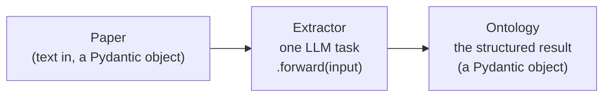

Everything the `lemat-synth` command does, you can also do from a Python script or
a Jupyter notebook. This page is written for scientists who are comfortable running
Python but do not want to read the source code first.

**Use the Python API when you want to:**

- run the extraction over a list of papers you built yourself (from a spreadsheet,
  a literature search, a HuggingFace dataset, …);
- change *what* is extracted — e.g. keep every dopant concentration as a separate
  material instead of merging them;
- inspect intermediate results (the material list, the raw ontology, the judge's
  reasoning) before deciding what to keep;
- push results straight into pandas, a plot, or your own database.

If you only want to run the standard extraction over a folder of PDFs, the
[CLI]() is simpler and does the same thing.

---

## Before you start

Install the package, then put your API keys in a `.env` file at the repository
root (see [Installation]()). Every script
should load that file before touching the library:

```python
from dotenv import load_dotenv

load_dotenv()  # reads .env, so GEMINI_API_KEY etc. become available
```

`GEMINI_API_KEY` alone is enough for material and synthesis extraction.
Plot reading additionally needs `ANTHROPIC_API_KEY`, and PDF OCR through Mistral
needs `MISTRAL_API_KEY`.

---

## The mental model

There are only three kinds of object you need to understand.



| Object | What it is | Analogy |
|---|---|---|
| **Extractor** (`DspyTextExtractor`, `DspySynthesisExtractor`, …) | One configured LLM task. You build it once, then call `.forward(...)` on as many papers as you like. | An instrument: calibrate once, run many samples through it. |
| **Ontology** (`GeneralSynthesisOntology`) | The structured answer — target compound, starting materials, steps, conditions, equipment. It is a [Pydantic](https://docs.pydantic.dev) model, so `.model_dump()` turns it into a plain dictionary. | The filled-in data sheet. |
| **Pipeline** (`SynthesisPerformancePipeline`) | All the extractors wired together, so one call processes a whole paper. | The automated workflow that runs every instrument in order. |

Every extractor has the same shape: you give it a *signature* (what the task is,
in plain English) and an *LM* (which model to call). Then `.forward(input)`
returns the answer.

---

## Example 1 — one paper, from text to structured synthesis

This is the smallest useful script: find the materials in a paper, then extract
the synthesis of the first one.

```python
import json

from dotenv import load_dotenv

load_dotenv()

from llm_synthesis.transformers.material_extraction.dspy_extraction import (
    DspyTextExtractor,
    make_dspy_text_extractor_signature,
)
from llm_synthesis.transformers.synthesis_extraction.dspy_synthesis_extraction import (
    DspySynthesisExtractor,
    make_dspy_synthesis_extractor_signature,
)
from llm_synthesis.utils import clean_text
from llm_synthesis.utils.dspy_utils import get_llm_from_name

paper_text = clean_text(open("my_paper.md").read())  # (1)!

# --- Step 1: which materials were synthesised? -----------------------------
material_extractor = DspyTextExtractor(
    signature=make_dspy_text_extractor_signature(
        instructions="Extract ONLY the materials that were synthesised in this paper.",
        output_description=(
            "The synthesised materials as a comma-separated list of chemical "
            "formulas, e.g. 'Fe2O3, 5%Ni/Fe2O3'."
        ),
    ),
    lm=get_llm_from_name("gemini-2.0-flash", model_kwargs={"temperature": 0.0}),
)

materials_text = material_extractor.forward(input=paper_text)  # (2)!
materials = [m.strip() for m in materials_text.replace("\n", ",").split(",") if m.strip()]
print(materials)  # ['Fe2O3', '5%Ni/Fe2O3']

# --- Step 2: how was the first one made? -----------------------------------
synthesis_extractor = DspySynthesisExtractor(
    signature=make_dspy_synthesis_extractor_signature(
        instructions="Extract the complete synthesis procedure for this material."
    ),
    lm=get_llm_from_name(
        "gemini-2.0-flash",
        model_kwargs={"temperature": 0.0, "max_tokens": 12000},
    ),
)

synthesis = synthesis_extractor.forward(input=(paper_text, materials[0]))  # (3)!

print(synthesis.target_compound, "—", synthesis.synthesis_method)
for step in synthesis.steps:
    print(step.step_number, step.action, step.conditions)

json.dump(synthesis.model_dump(), open("Fe2O3.json", "w"), indent=2)  # (4)!
```

1. `clean_text` strips markdown artefacts and base64 images that would otherwise
   waste thousands of tokens. Always run it on paper text before an LLM call.
2. The material extractor returns **plain text**, not a list — the LLM writes a
   comma-separated string and you split it yourself.
3. The synthesis extractor takes a **tuple**: `(paper_text, material_name)`.
   It is called once per material.
4. `.model_dump()` converts the Pydantic object into a dictionary you can dump to
   JSON, put in a DataFrame, or store in a database.


`temperature=0.0` makes the extraction as reproducible as an LLM gets — use it
for anything you intend to publish. `max_tokens` needs to be generous
(8000–12000) for synthesis extraction, because long procedures produce long JSON.


---

## Example 2 — steering *what* gets extracted

The `instructions` and `output_description` strings are the scientific knobs.
They are sent to the model verbatim, so writing them is exactly like briefing a
new student. This is the single most effective way to adapt the tool to your
sub-field.

```python
# Keep every variant separate instead of merging them into one generic name.
material_sig = make_dspy_text_extractor_signature(
    instructions=(
        "Extract ALL distinct material compositions that were synthesised and "
        "tested in this paper. If the paper studies several variants of the same "
        "material (different loadings, dopant concentrations, calcination "
        "temperatures), list EACH variant separately — do NOT merge them."
    ),
    output_description=(
        "All distinct synthesised compositions as a comma-separated list, keeping "
        "loadings and promoters, e.g. '1%Ru-10%K/CaO, 3%Ru-10%K/CaO, 5%Ru/CaO'."
    ),
)
```

The same applies to `make_dspy_synthesis_extractor_signature(instructions=...)`,
e.g. *"Extract only the primary synthesis route and ignore comparison samples
taken from the literature."*


What the *fields* of the output are — `target_compound`, `steps`, `conditions`,
and the closed list of allowed `synthesis_method` values — is fixed by the
ontology, not by the prompt. To add a new field or a new allowed method, see
[Data Models]() and the
[Architecture guide]().


---

## Example 3 — scoring the extraction with the LLM judge

The judge reads the paper and the extracted ontology, and returns scores from
1 (poor) to 5 (excellent) on seven dimensions, each with written reasoning.
Use it to triage: keep the high-scoring extractions, review the rest by hand.

```python
import json

from llm_synthesis.metrics.judge.general_synthesis_judge import (
    DspyGeneralSynthesisJudge,
    make_general_synthesis_judge_signature,
)

judge = DspyGeneralSynthesisJudge(
    signature=make_general_synthesis_judge_signature(),
    lm=get_llm_from_name(
        "gemini-2.0-flash",
        model_kwargs={"temperature": 0.1, "max_tokens": 8000},
    ),
)

evaluation = judge.forward(
    (paper_text, json.dumps(synthesis.model_dump()), materials[0])
)

print(evaluation.scores.overall_score)                    # e.g. 4.5
print(evaluation.scores.procedure_completeness_score)     # e.g. 4.0
print(evaluation.scores.procedure_completeness_reasoning) # why it got that score
print(evaluation.missing_information)                     # what the extractor missed
```

Full list of scores and fields: [Metrics & Judges]().

---

## Example 4 — starting from a PDF

Papers usually arrive as PDFs. Convert once to markdown, then reuse that text for
every experiment — re-running OCR on each attempt is slow and, with Mistral,
costs money.

```python
from pathlib import Path

from llm_synthesis.transformers.pdf_extraction import (
    DoclingPDFExtractor,
    MistralPDFExtractor,
)

pdf_extractor = DoclingPDFExtractor()          # runs locally, no API key
# pdf_extractor = MistralPDFExtractor(structured=False)  # better OCR, needs MISTRAL_API_KEY

markdown = pdf_extractor.forward(Path("my_paper.pdf").read_bytes())
Path("my_paper.md").write_text(markdown)
```

The supplementary information often contains the actual synthesis. Extract it
too and pass it along in a `Paper` object (next example) — the pipeline searches
both.

---

## Example 5 — the whole pipeline in one object

`SynthesisPerformancePipeline` bundles the extractors together, loops over the
materials for you, runs the judge, and writes one JSON file per material.

```python
from pathlib import Path

from llm_synthesis.models.paper import Paper
from llm_synthesis.services.pipelines.synthesis_performance_pipeline import (
    SynthesisPerformancePipeline,
)

paper = Paper(
    name="Do2024Turning",
    id="Do2024Turning",
    publication_text=Path("my_paper.md").read_text(),
    si_text=Path("my_paper_SI.md").read_text(),  # optional, "" if you have none
)

pipeline = SynthesisPerformancePipeline(
    material_extractor=material_extractor,
    synthesis_extractor=synthesis_extractor,
    judge=judge,
)

result = pipeline.process_paper(paper, skip_figures=True)  # (1)!

print(result.materials)
for entry in result.results:
    print(entry.material, entry.evaluation.scores.overall_score)

SynthesisPerformancePipeline.save_results(result, output_dir="results")  # (2)!
```

1. `skip_figures=True` runs synthesis extraction only. **Leave it out only if you
   also configured the plot components** — otherwise the pipeline starts
   downloading the figure-segmentation model for nothing.
2. Writes `results/<paper_id>/<material>.json` plus a summary, exactly like the
   CLI does. See [Output Format]().

### Adding performance-plot extraction

Reading numbers off figures needs three more components: a plot extractor (a
vision model), a linker that matches plot series to your materials, and a
`PlotFilterConfig` that decides which plots are relevant for your domain.

```python
from llm_synthesis.config.plot_filter_config import PlotFilterConfig
from llm_synthesis.transformers.performance_linking.series_material_linker import (
    SeriesMaterialLinker,
)
from llm_synthesis.transformers.plot_extraction.claude_extraction.plot_data_extraction import (
    ClaudeLinePlotDataExtractor,
)

pipeline = SynthesisPerformancePipeline(
    material_extractor=material_extractor,
    synthesis_extractor=synthesis_extractor,
    judge=judge,
    plot_extractor=ClaudeLinePlotDataExtractor(  # a raw Anthropic model id
        model_name="claude-sonnet-4-20250514"
    ),
    series_linker=SeriesMaterialLinker(lm=get_llm_from_name("gemini-3.0-pro")),
    plot_filter_config=PlotFilterConfig.for_catalysis(),  # or .for_superconductivity(),
)                                                        # .for_electrochemistry(), .no_filter()

result = pipeline.process_paper(paper)  # no skip_figures → figures are processed
```

`PlotFilterConfig` matches axis labels and units, so a catalysis filter keeps
"conversion vs. temperature" and discards XRD patterns. See
[Configuration API]() for the keyword lists, and
[`src/llm_synthesis/cli.py`](https://github.com/LeMaterial/lematerial-llm-synthesis/blob/main/src/llm_synthesis/cli.py)
(`_build_pipeline_from_cfg`) for the complete reference wiring.

---

## Example 6 — many papers

For a folder of `.txt`/`.md` files, `FSPaperLoader` builds the `Paper` objects for
you (a file named `<paper>_SI.txt` is picked up automatically as supplementary
information):

```python
from llm_synthesis.data_loader.paper_loader.fs_paper_loader import FSPaperLoader

papers = FSPaperLoader(data_dir="/path/to/my/text_papers").load()

for paper in papers:
    result = pipeline.process_paper(paper, skip_figures=True)
    if result is not None:                       # None = no materials found
        SynthesisPerformancePipeline.save_results(result, "results")
```

Papers are independent, so processing them one at a time wastes most of the wall
clock waiting on the API. The async version runs the LLM calls concurrently, with
a semaphore capping how many are in flight:

```python
import asyncio

from llm_synthesis.utils.concurrency import get_max_concurrent_llm_calls


async def run_all(papers):
    semaphore = asyncio.Semaphore(get_max_concurrent_llm_calls())  # (1)!
    tasks = [
        pipeline.process_paper_async(p, semaphore, skip_figures=True)
        for p in papers
    ]
    return await asyncio.gather(*tasks)


results = asyncio.run(run_all(papers))
```

1. Defaults to 10, and is tunable with the environment variable
   `LLM_SYNTHESIS_MAX_CONCURRENT_LLM_CALLS`. Lower it if the provider starts
   returning rate-limit errors.


Always try 2–3 papers before launching a batch of 500. Cost and runtime scale
with the number of *materials*, not papers: a paper with 12 catalyst variants
costs roughly 12 synthesis calls plus 12 judge calls.


---

## Working with the results

Every result object is a Pydantic model, so the route into your usual tooling is
always `.model_dump()`:

```python
import pandas as pd

rows = []
for entry in result.results:
    s = entry.synthesis
    rows.append({
        "paper": result.paper_id,
        "material": entry.material,
        "method": s.synthesis_method,
        "compound_type": s.target_compound_type,
        "n_steps": len(s.steps),
        "max_temperature_C": max(
            (st.conditions.temperature for st in s.steps
             if st.conditions and st.conditions.temperature is not None),
            default=None,
        ),
        "score": entry.evaluation.scores.overall_score if entry.evaluation else None,
    })

df = pd.DataFrame(rows)
df.to_csv("summary.csv", index=False)
```

To go the other way — loading JSON files you produced earlier back into typed
objects:

```python
import json

from llm_synthesis.models.ontologies.general import GeneralSynthesisOntology

data = json.load(open("results/Do2024Turning/Fe2O3.json"))
synthesis = GeneralSynthesisOntology.model_validate(data["synthesis"])
```

---

## Choosing a model

Two ways to name a model:

```python
# 1. A registry key — API key, base URL and quirks are handled for you.
lm = get_llm_from_name("claude-sonnet-4.6", model_kwargs={"temperature": 0.0})

# 2. Any LiteLLM model string, for models not in the registry.
from llm_synthesis.utils.llms import SystemPrefixedLM

lm = SystemPrefixedLM(
    "",                                            # optional system prompt
    "openrouter/google/gemini-3-flash-preview",
    api_base="https://openrouter.ai/api/v1",
    temperature=0.0,
)
```

The registry keys (`gemini-2.0-flash`, `gemini-2.5-pro`, `claude-sonnet-4.6`,
`gpt-4.1`, `mistral-large`, `deepseek-v3.2`, …) and the API key each one needs are
listed in the [Configuration guide](#available-llm-models).

A system prompt can be attached to any model, which is how the extractors are told
about materials-science conventions:

```python
from llm_synthesis.utils import read_prompt_str_from_txt

lm = get_llm_from_name(
    "gemini-2.0-flash",
    model_kwargs={"temperature": 0.0, "max_tokens": 12000},
    system_prompt=read_prompt_str_from_txt(
        "examples/system_prompts/synthesis_extraction/default.txt"
    ),
)
```

---

## Common pitfalls

| Symptom | Cause | Fix |
|---|---|---|
| `ValueError: LLM name '...' not supported` | The name is not a registry key | Use a listed key, or build the model with `SystemPrefixedLM` and a LiteLLM string |
| Extraction returns a nearly empty ontology | The paper text never reached the model — often an unparsed PDF, or the synthesis lives in the SI | Check `len(paper.publication_text)`, and pass `si_text` |
| Truncated / invalid JSON errors | `max_tokens` too small for a long procedure | Raise `max_tokens` to 12000 |
| The script downloads a large vision model unexpectedly | `process_paper` without `skip_figures=True` | Pass `skip_figures=True` for synthesis-only runs |
| Rate-limit errors in batch runs | Too many concurrent calls | Lower `LLM_SYNTHESIS_MAX_CONCURRENT_LLM_CALLS` |
| Every variant collapsed into one material | Default material prompt merges variants | Use the instructions from [Example 2](#example-2-steering-what-gets-extracted) |

More in [Troubleshooting]().

---

## Where to look things up

| You want… | Page |
|---|---|
| Every argument of the pipeline class | [API Reference — Pipeline]() |
| The full ontology: fields, units, allowed values | [API Reference — Data Models]() |
| Extractor classes and signature builders | [API Reference — Transformers]() |
| Judge scores and linking evaluation | [API Reference — Metrics & Judges]() |
| `PlotFilterConfig`, the LLM registry, DSPy helpers | [API Reference — Configuration]() |
| Running the same thing from YAML instead of Python | [Configuration guide]() |
| Worked, runnable notebooks | [Tutorials]() — `examples/notebooks/tutorials/` |
